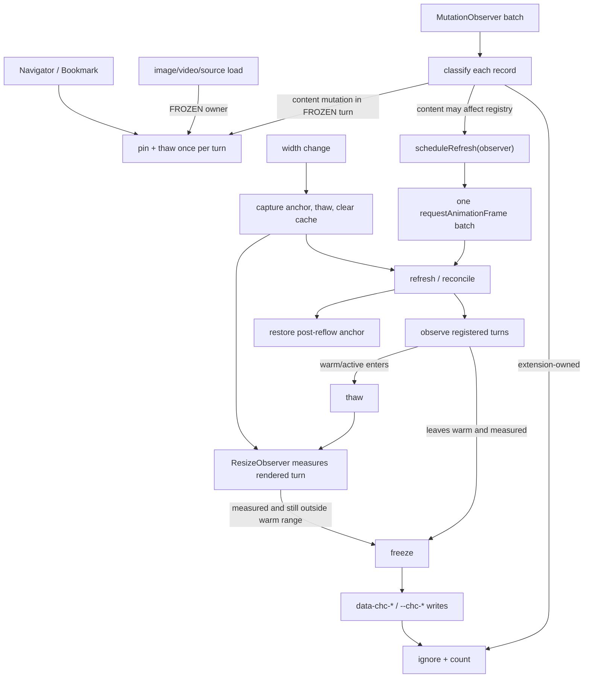

# Performance Virtualization V1 Audit

This document records synthetic Chromium evidence and lifecycle invariants before real ChatGPT benchmarking. It is not a claim that Performance Virtualization outperforms the other modes.

## Validation status

| Area | Status |
| --- | --- |
| Implementation | DONE |
| Synthetic Chromium validation | DONE |
| Lifecycle and race-condition hardening | DONE |
| Benchmark protocol | DONE |
| Real ChatGPT correctness | PARTIAL / IN PROGRESS |
| Real runtime benchmark | NOT TESTED |
| Real cold-open benchmark | NOT TESTED |
| Native accessibility audit | NOT TESTED |
| Production freeze strategy | NOT FINAL |

## Hidden versus auto

The [CSS Containment Level 2 specification](https://drafts.csswg.org/css-contain-2/) gives the two strategies materially different user-agent semantics. `hidden` always skips descendant contents and excludes them from find-in-page, tab order, selection/focus, and the accessibility tree. `auto` may skip offscreen rendering while keeping descendants available to those browser features and must unskip relevant content when needed. Chrome's [`hidden=until-found` explanation](https://developer.chrome.com/docs/css-ui/hidden-until-found) independently shows that ordinary hidden content needs special browser behavior to become findable; V1 does not use that HTML feature.

Chromium harness result for a token inside a distant FROZEN turn:

| Behavior | `hidden` | `auto` |
| --- | --- | --- |
| Computed rendering strategy | `hidden` | `auto` |
| Chromium `window.find` proxy | no match | match |
| Programmatic descendant focus | rejected | accepted |
| Programmatic descendant selection | empty | token selected |
| Extension Navigator text lookup | found | found |
| Navigator/Bookmark pre-thaw | passed | passed |
| Expected performance tradeoff | strongest deterministic render skip; breaks browser reachability while frozen | browser-reachable content; UA may render relevant/offscreen content, so savings are less deterministic |

Native Chrome/Edge Ctrl+F, sequential Tab behavior, mouse selection, and accessibility-tree exposure remain mandatory real-page checks. The automation harness records `window.find`, focus, and selection as repeatable proxies; it does not treat them as a substitute for the browser UI and accessibility inspector.

The default remains `hidden` for evidence continuity. `virtualizationFreezeStrategy: 'auto'` is available only through internal storage/debug configuration and requires a page reload. Choosing the production default is deferred until the five-group real benchmark.

## Mutation and thaw audit

Mutation batches are now classified record-by-record before thawing. Extension-owned nodes and synchronous extension writes to `data-chc-*` or `--chc-*` are ignored. A batch deduplicates affected FROZEN turns, so multiple records for one turn produce one mutation-triggered thaw. Resource loads have a separate counter.

Synthetic stress-observer evidence for both strategies:

- Extension child mutation: ignored, no thaw, `extensionMutationIgnoredCount` increments.
- Two content records in one frozen turn: one mutation-triggered thaw.
- Image load in one frozen turn: one resource-triggered thaw.
- Settled idle windows: zero delta for mutation/resource thaw, observer refresh, thaw, and reconcile.
- Two observer refresh requests in the same animation-frame window: one accepted observer refresh.

The production page observer currently watches `childList + subtree`; the harness deliberately also watches attributes and character data to catch future feedback regressions.

## Width invalidation

On width change V1 intentionally uses a minimal non-persistent policy: thaw registered turns, clear in-memory height entries, mark measurements stale, measure at the new width, refreeze distant turns, and restore the post-reflow viewport anchor. No responsive or persistent cache is introduced.

Final synthetic Chromium results were the same for `hidden` and `auto`:

| Transition | Expected height | Actual height | Error | Total anchor displacement | Natural reflow | Virtualization-added |
| --- | ---: | ---: | ---: | ---: | ---: | ---: |
| 1600 -> 1200 | 26526 px | 26546 px | 0.0754% | 231.2 px | 231.0 px | 0.2 px |
| 1200 -> 900 | 26526 px | 26546 px | 0.0754% | 0 px | 0 px | 0 px |
| 900 -> 1600 | 20646 px | 20666 px | 0.0969% | 273.4 px | 273.0 px | 0.4 px |

The large total displacement in two transitions is caused by natural text reflow at the instant width changes. After that reflow, V1 invalidation/refreeze added less than one pixel in this harness. Real ChatGPT content (code blocks, tables, images, math, canvases) still needs trace and visual validation.

## Observer lifecycle

Enforced invariants:

- `freeze()` cannot indirectly thaw through extension-owned mutation records.
- `thaw()` does not directly call reconcile; observer refreshes share one animation-frame batch.
- Extension-owned `data-chc-*`, `--chc-*`, panel, toggle, bookmark, and placeholder mutations are not ChatGPT content mutations.
- A mutation batch thaws each affected turn at most once.
- Disable/remount removes strategy/state/intrinsic-size writes and observer registrations.
- `maxTurnsProcessedPerReconcile` exposes unexpectedly broad reconcile work without adding high-frequency monitoring.
- Historical diagnostic counters accumulate only while `debugMode` is enabled; current registry/state counts remain available normally.
- Observer instances and async pin/refresh/resize/navigation work are bound to a lifecycle generation. Route changes, root changes, disable, and destroy invalidate the generation and clear tracked timers.
- Late IO/RO/mutation delivery must resolve to the current registry and conversation before it may change state or schedule reconcile.

## Remaining real-page gates

- Native Ctrl+F result counts and next/previous navigation in both Chrome and Edge.
- Sequential Tab navigation and focus restoration across skipped content.
- Screen-reader/accessibility-tree behavior.
- Streaming responses, delayed media, code canvases, math, and background ChatGPT DOM churn.
- DevTools Layout/Paint traces, memory, and scroll behavior for all five benchmark groups.
- SPA remount/route behavior against current production ChatGPT markup.
